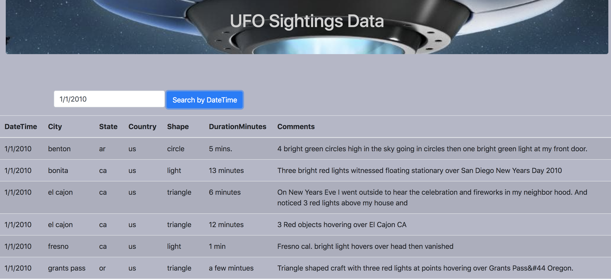

# Javascript_and_DOM_Manipulation

### 1: Automatic Table and Date Search

* Created a basic HTML web page.

* Using the ufo dataset provided in the form of a JavaScript object, developed code that appends a table to the web page and then adds new rows of data for each UFO sighting.

* Defined a column for `date/time`, `city`, `state`, `country`, `shape`, and `comment` data.

* Added an `input` tag to the HTML document and written JavaScript code that will search through the `date/time` column to find rows that matches the input.
